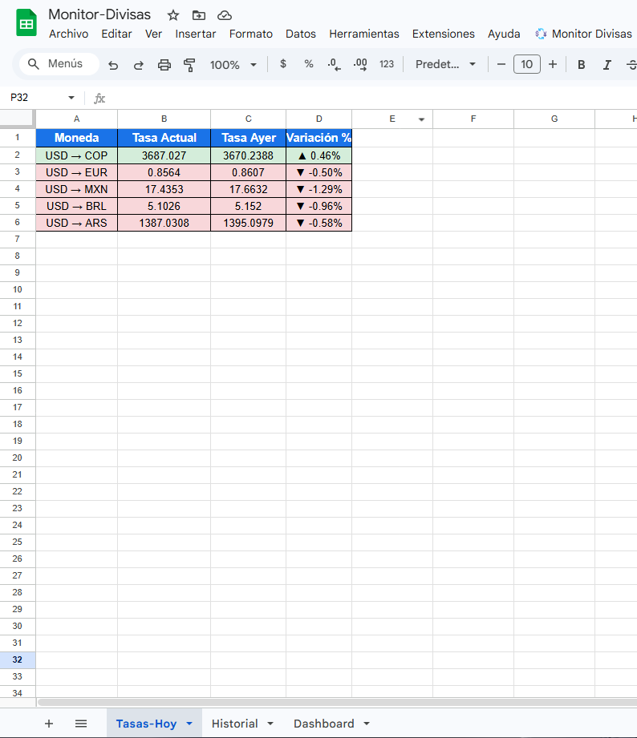
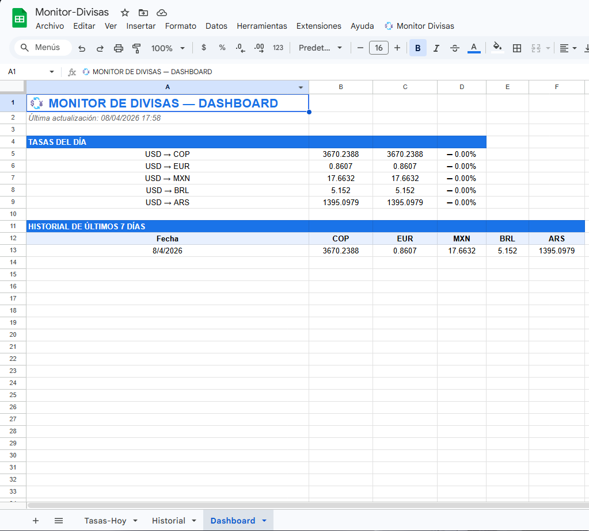
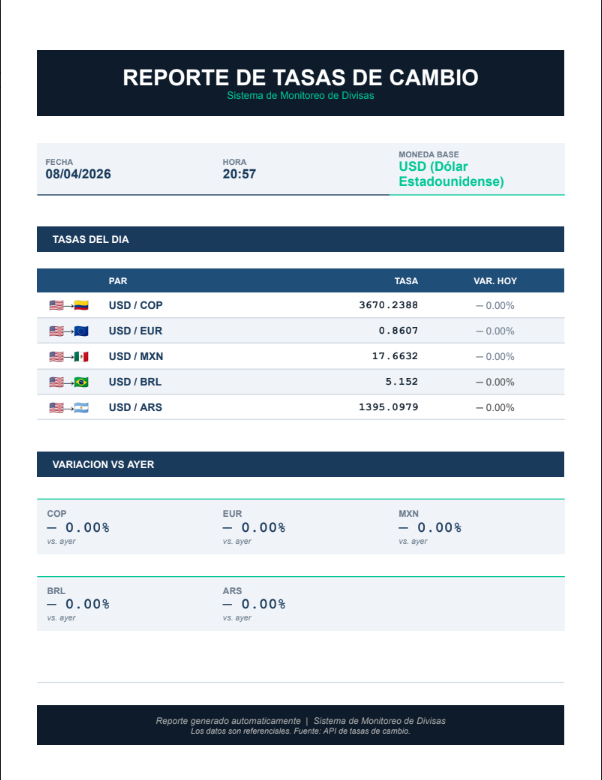
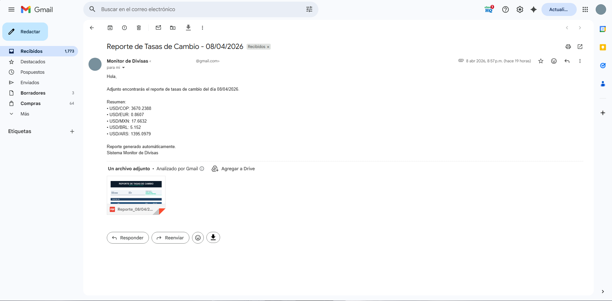

# Monitor de Divisas — Google Apps Script

Sistema automático de monitoreo de tasas de cambio construido con
Google Apps Script. Se conecta a una API REST externa, procesa los
datos, genera reportes PDF profesionales y los envía por correo
todos los días a las 8am sin intervención humana.

---

## Demo






---

## Que hace este proyecto

- Conecta con [ExchangeRate API](https://exchangerate-api.com/) usando `UrlFetchApp`
- Extrae tasas de cambio en tiempo real (USD vs COP, EUR, MXN, BRL, ARS)
- Guarda un historial diario en Google Sheets
- Calcula la variacion porcentual vs el dia anterior
- Colorea las filas automaticamente (verde = subio, rojo = bajo)
- Genera un reporte PDF desde una plantilla de Google Docs
- Envia el reporte por Gmail con el PDF adjunto
- Trigger diario automatico a las 8am sin intervención manual
- Dashboard con KPIs y tabla de los ultimos 7 dias

---

## Tecnologias

- **Google Apps Script** — backend y automatizacion
- **UrlFetchApp** — conexion a API REST externa
- **Google Sheets** — almacenamiento de datos e historial
- **Google Docs** — plantilla para generacion de PDF
- **Gmail API** — envio automatico de reportes
- **ExchangeRate API** — fuente de datos de divisas (plan gratuito)

---

## Estructura del proyecto

```
monitor-divisas-google-apps-script/
├── Codigo.gs              # Script principal
├── _config.example.gs     # Plantilla de configuracion
├── appsscript.json        # Manifiesto y permisos
├── .gitignore             # Excluye _config.gs con datos privados
├── screenshots/           # Capturas del proyecto funcionando
└── README.md

```
---

## Instalacion paso a paso

### 1. Clonar o descargar el proyecto

Descarga los archivos `Codigo.gs`, `_config.example.gs` y `appsscript.json`.

### 2. Obtener API Key gratuita

1. Ve a [exchangerate-api.com](https://exchangerate-api.com)
2. Regístrate con tu correo
3. Copia tu API Key del dashboard

```
### 3. Preparar Google Drive

Crea esta estructura en tu Drive:

```text
Proyecto-API-Reportes/
├── Plantillas/    # Aquí va el Google Doc de plantilla
└── Reportes-PDF/  # Aquí se guardan los PDFs generados
```

### 4. Crear la plantilla en Google Docs

Crea un Google Doc en la carpeta `Plantillas/` con estos placeholders:

Fecha: {{fecha}}
Hora: {{hora}}
Base: {{moneda_base}}

USD/COP: {{usd_cop}} Variacion: {{variacion_cop}}
USD/EUR: {{usd_eur}} Variacion: {{variacion_eur}}
USD/MXN: {{usd_mxn}} Variacion: {{variacion_mxn}}
USD/BRL: {{usd_brl}} Variacion: {{variacion_brl}}
USD/ARS: {{usd_ars}} Variacion: {{variacion_ars}}


### 5. Crear el Google Sheets

Crea un archivo con 3 hojas:
- `Tasas-Hoy`
- `Historial`
- `Dashboard`

### 6. Configurar Apps Script

1. En el Sheets ve a **Extensiones** → **Apps Script**
2. Crea 2 archivos: `_config.gs` y `Codigo.gs`
3. Copia el contenido de `_config.example.gs` en `_config.gs`
4. Rellena los 5 valores en `_config.gs`:

```javascript
const CONFIG = {
  API_KEY:              'tu_api_key_de_exchangerate',
  EMAIL_DESTINATARIO:   'tu_correo@gmail.com',
  ID_PLANTILLA_REPORTE: 'id_del_google_doc',
  ID_CARPETA_REPORTES:  'id_carpeta_reportes_pdf',
  ID_CARPETA_TEMPORAL:  'id_carpeta_plantillas',
  MONEDAS:              ['COP', 'EUR', 'MXN', 'BRL', 'ARS']
};
```

5. Copia el contenido de `Codigo.gs`
6. Reemplaza `appsscript.json` con el del repositorio

### 7. Configurar trigger automatico

1. En Apps Script → icono de reloj (Activadores)
2. Agregar activador:
   - Funcion: `ejecutarDiario`
   - Fuente: `Segun el tiempo`
   - Tipo: `Temporizador diario`
   - Hora: `8:00 a 9:00 a.m.`

### 8. Primera ejecucion

1. Recarga el Sheets — aparece el menu **Monitor Divisas**
2. Ejecuta **Actualizar tasas ahora**
3. Ejecuta **Actualizar Dashboard**
4. Ejecuta **Generar y enviar reporte**

---

## Uso del menu

| Opcion | Descripcion |
|---|---|
| Actualizar tasas ahora | Llama a la API y actualiza Sheets |
| Actualizar Dashboard | Regenera tablas y comparativas |
| Generar y enviar reporte | Crea PDF y lo envia por correo |
| Limpiar tasas de hoy | Resetea la hoja Tasas-Hoy |

---

```
## Cómo funciona internamente


ejecutarDiario() [trigger 8am]
|
├── actualizarTasas()
|   └── UrlFetchApp.fetch(API) → JSON
|   └── Escribe en Tasas-Hoy y Historial
|   └── Calcula variacion vs ayer
|
├── actualizarDashboard()
|   └── Copia KPIs al Dashboard
|   └── Muestra ultimos 7 dias del historial
|
└── generarYEnviarReporte()
    └── Copia plantilla Google Docs
    └── Reemplaza {{placeholders}} con datos reales
    └── Convierte a PDF
    └── Guarda en Drive
    └── Envia por Gmail con PDF adjunto
    └── Elimina copia temporal

```
---

## Seguridad

- El archivo `_config.gs` con la API Key y los IDs esta en `.gitignore`
- Nunca se sube informacion sensible al repositorio
- Solo se sube `_config.example.gs` con valores vacios como guia

---

## Autor

**Sebastian Felipe Otalora Guevara**
Estudiante de Inteligencia Artificial y Computo — Bogota, Colombia
[GitHub](https://github.com/SebastiianGuevara)

---

## Licencia

MIT License — libre para usar y modificar con creditos al autor.
